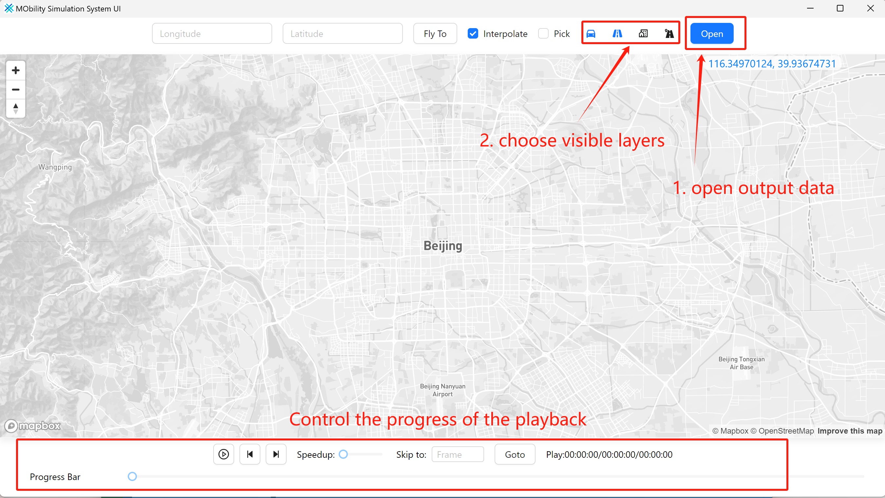
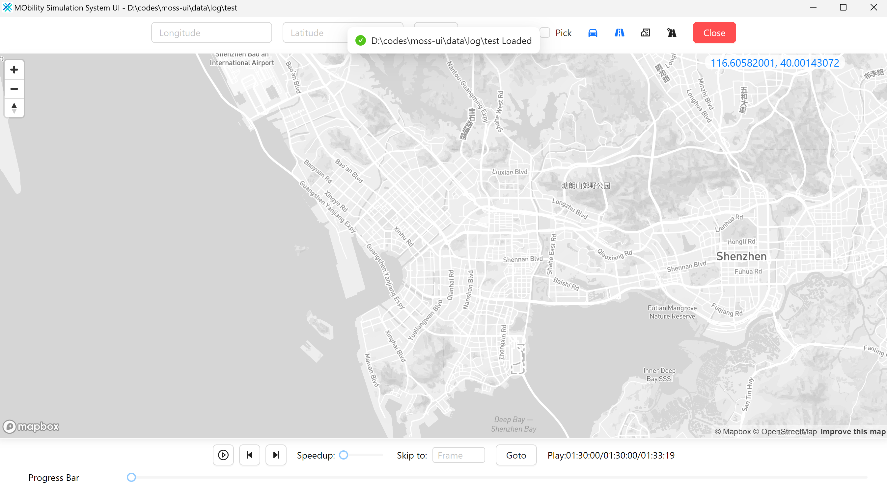

# MOSS-UI

A simple UI to visualize the AVRO output of the MOSS project.

The project is **unstable** now and faces data reading performance challenges to handle the AVRO output data without indexing that is usually provided by a database.

ATTENTION:
- The car model in the project is 5m × 2m, which cannot be automatically adjusted by the vehicle attributes in the moss input person file.

## How to run

1. Get the output dir of the MOSS project. 
```python
from moss import Engine, TlPolicy, Verbosity
MAP_PATH = "./data/temp/map.pb"
TRIP_PATH = "./data/temp/persons.pb"
eng = Engine(
+   name="test",
    map_file=MAP_PATH,
    person_file=TRIP_PATH,
    start_step=8 * 3600,
+   output_dir="./output",
    verbose_level=Verbosity.ALL,
    device=0,
)
```
The related documentation is https://docs.fiblab.net/moss#Engine.

2. Open the MOSS-UI and select the output directory. In the file dialog, please select the `moss.yml` file in the output directory of the MOSS project.



3. When you open a file, please wait for the data to be loaded. If the loading process is finished, you will see a message like below and the map will move to the center of the output data.



4. You can open/close the layer by clicking the icon on the top. You can also change the time by dragging the slider on the bottom.

## For Developers

This is a Wails React-TS project.

You can configure the project by editing `wails.json`. More information about the project settings can be found
here: https://wails.io/docs/reference/project-config

#### Prequisites

You will need to have the Wails development environment installed. You can find instructions here: https://wails.io/docs/gettingstarted/installation

#### Live Development

To run in live development mode, run `wails dev` in the project directory. This will run a Vite development
server that will provide very fast hot reload of your frontend changes. If you want to develop in a browser
and have access to your Go methods, there is also a dev server that runs on http://localhost:34115. Connect
to this in your browser, and you can call your Go code from devtools.

#### Building

To build a redistributable, production mode package, use `wails build`.

Command to build the project for all platforms:
```bash
wails build -platform windows/amd64 
```
